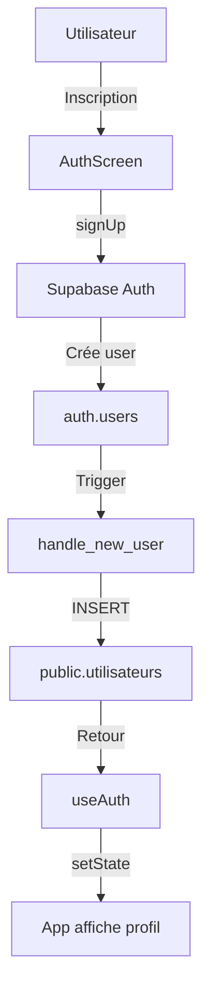

# Harvest-More
Brand new version of CAFCOOP App 
# 🍃 CAFCOOP - Auth System

Système d'authentification complet pour l'application CAFCOOP, utilisant Next.js 14 et Supabase.

---

## 🎯 Fonctionnalités

- ✅ **Connexion Email/Password**
- ✅ **Inscription avec création automatique de profil**
- ✅ **Magic Links (OTP)**
- ✅ **Gestion de session persistante**
- ✅ **Liaison automatique auth.users ↔ public.utilisateurs**
- ✅ **Row Level Security (RLS)**
- ✅ **Hook React personnalisé `useAuth`**
- ✅ **API Routes sécurisées (service_role)**
- ✅ **Responsive UI**

---

## 📁 Structure du Projet

```
cafcoop-auth/
├── components/
│   └── AuthScreen.js          # Composant UI d'authentification
├── hooks/
│   └── useAuth.js             # Hook React pour gérer l'état auth
├── lib/
│   └── supabase.js            # Client Supabase (browser + server)
├── pages/
│   ├── index.js               # Page principale
│   └── api/
│       └── auth/
│           └── link-profile.js # API pour lier profil CAFCOOP
├── supabase-setup.sql         # Script SQL pour configurer la DB
├── DEPLOYMENT_GUIDE.md        # Guide de déploiement Vercel
├── package.json
└── .env.local.example         # Template variables d'environnement
```

---

## 🚀 Installation Locale

### 1. Cloner le repository

```bash
git clone https://github.com/DeadManDaed/CAFCOOP.git
cd CAFCOOP
```

### 2. Installer les dépendances

```bash
npm install
```

### 3. Configurer les variables d'environnement

Copie `.env.local.example` en `.env.local` :

```bash
cp .env.local.example .env.local
```

Remplis les valeurs (récupère-les depuis Supabase Dashboard > Settings > API) :

```bash
NEXT_PUBLIC_SUPABASE_URL=https://xxxxxx.supabase.co
NEXT_PUBLIC_SUPABASE_ANON_KEY=eyJhbGci...
SUPABASE_SERVICE_ROLE_KEY=eyJhbGci...
```

### 4. Configurer la base de données Supabase

1. Va dans **Supabase Dashboard > SQL Editor**
2. Exécute le contenu de `supabase-setup.sql`
3. Vérifie qu'il n'y a pas d'erreurs

### 5. Lancer le serveur de développement

```bash
npm run dev
```

Ouvre http://localhost:3000 dans ton navigateur.

---

## 📊 Architecture Auth

### Flux d'inscription



### Flux de connexion

```mermaid
graph TD
    A[Utilisateur] -->|Login| B[AuthScreen]
    B -->|signInWithPassword| C[Supabase Auth]
    C -->|Session créée| D[onAuthStateChange]
    D -->|Récupère user.id| E[useAuth.loadProfile]
    E -->|SELECT WHERE id_auth| F[public.utilisateurs]
    F -->|Si NULL| G[/api/auth/link-profile]
    G -->|INSERT| H[Profil créé]
    F -->|Si EXISTS| I[setState profile]
    H --> I
    I -->|Render| J[App authentifiée]
```

### Sécurité

- **Client-side** : Utilise `NEXT_PUBLIC_SUPABASE_ANON_KEY` (sécurisée par RLS)
- **Server-side** : Utilise `SUPABASE_SERVICE_ROLE_KEY` (bypass RLS, admin)
- **RLS Policies** : Les utilisateurs ne peuvent voir que leur propre profil
- **API Routes** : Protégées côté serveur, jamais exposées au client

---

## 🧪 Tests

### Créer un utilisateur test

1. Ouvre http://localhost:3000
2. Clique sur **Inscription**
3. Remplis :
   - Email : `test@cafcoop.com`
   - Mot de passe : `Test1234!`
4. Vérifie dans Supabase :
   - **Authentication > Users** : user doit exister
   - **Table Editor > utilisateurs** : profil doit être créé

### Tester la connexion

1. Déconnecte-toi
2. Reconnecte-toi avec `test@cafcoop.com` / `Test1234!`
3. Vérifie que l'app affiche le profil sans erreur

---

## 🔧 Commandes Utiles

```bash
# Développement local
npm run dev

# Build production
npm run build

# Lancer en mode production
npm start

# Vérifier les erreurs
npm run lint

# Déployer sur Vercel
vercel --prod
```

---

## 📝 Variables d'Environnement

| Variable | Description | Scope |
|----------|-------------|-------|
| `NEXT_PUBLIC_SUPABASE_URL` | URL du projet Supabase | Client + Server |
| `NEXT_PUBLIC_SUPABASE_ANON_KEY` | Clé publique Supabase | Client + Server |
| `SUPABASE_SERVICE_ROLE_KEY` | Clé admin Supabase | **Server ONLY** |

⚠️ **JAMAIS** exposer `SUPABASE_SERVICE_ROLE_KEY` côté client !

---

## 🐛 Dépannage

### "Configuration serveur incomplète"

➡️ Variables d'environnement manquantes. Vérifie `.env.local`.

### "Profil CAFCOOP non trouvé"

➡️ `/api/auth/link-profile` échoue. Vérifie :
1. `SUPABASE_SERVICE_ROLE_KEY` est définie
2. La table `utilisateurs` existe
3. Les RLS policies sont correctes

### "Invalid login credentials"

➡️ Email ou mot de passe incorrect. Vérifie dans Supabase > Authentication > Users.

### La page reste sur "Chargement..."

➡️ Ouvre la console (F12), cherche les erreurs réseau ou auth.

---

## 🚀 Déploiement sur Vercel

Consulte **[DEPLOYMENT_GUIDE.md](./DEPLOYMENT_GUIDE.md)** pour le guide complet.

**Résumé rapide** :

```bash
# 1. Push ton code sur GitHub
git push origin main

# 2. Connecte le repo sur Vercel
# https://vercel.com/new

# 3. Ajoute les env vars dans Vercel Dashboard
# Settings > Environment Variables

# 4. Deploy !
```

---

## 📚 Documentation

- **Supabase Auth** : https://supabase.com/docs/guides/auth
- **Next.js** : https://nextjs.org/docs
- **React Hooks** : https://react.dev/reference/react
- **Vercel** : https://vercel.com/docs

---

## 🤝 Contribution

1. Fork le projet
2. Crée une branche : `git checkout -b feature/ma-feature`
3. Commit : `git commit -m 'Add: ma feature'`
4. Push : `git push origin feature/ma-feature`
5. Ouvre une Pull Request

---

## 📄 Licence

MIT License - Harvest More © 2024 Khepri Design 

---

## 👤 Contact

**ShemsuMaât** - Propriétaire du projet  
GitHub: [@DeadManDaed](https://github.com/DeadManDaed)
